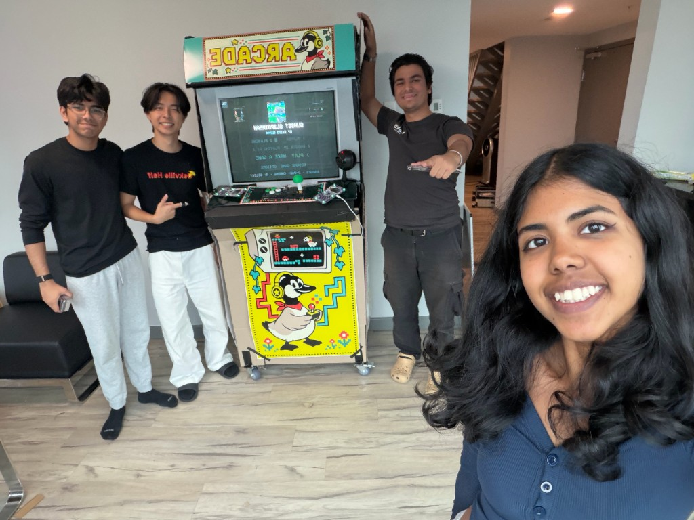
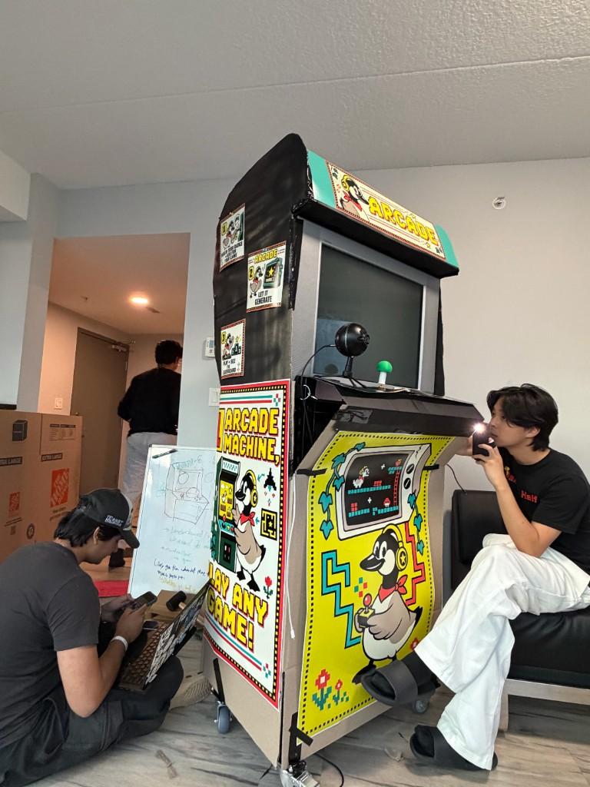
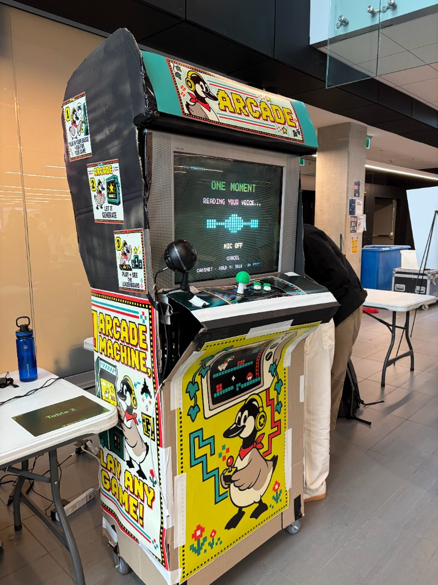
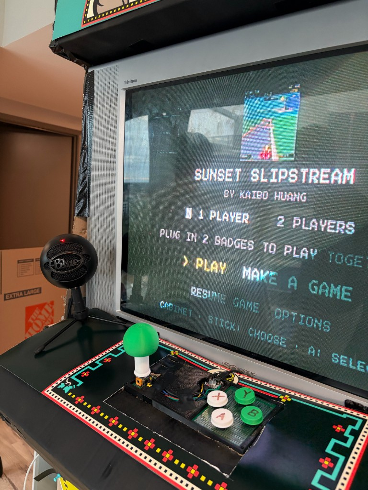
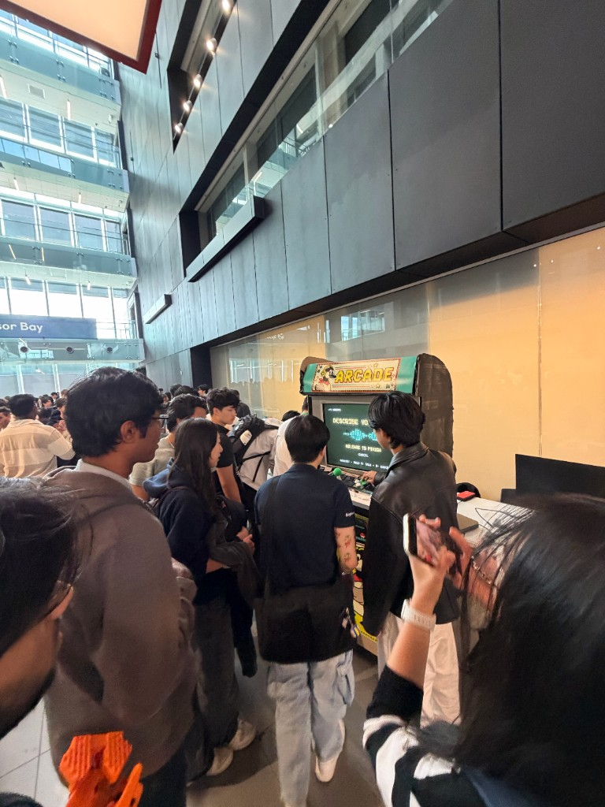
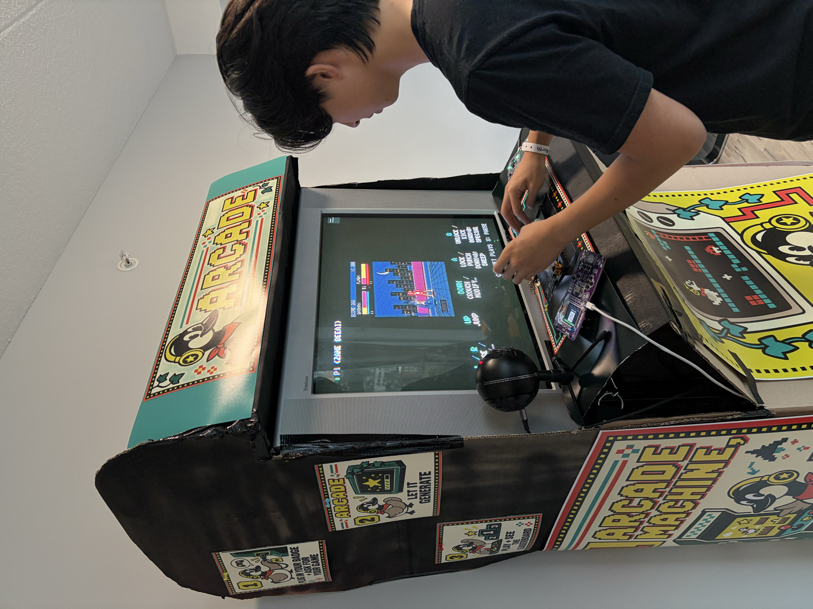
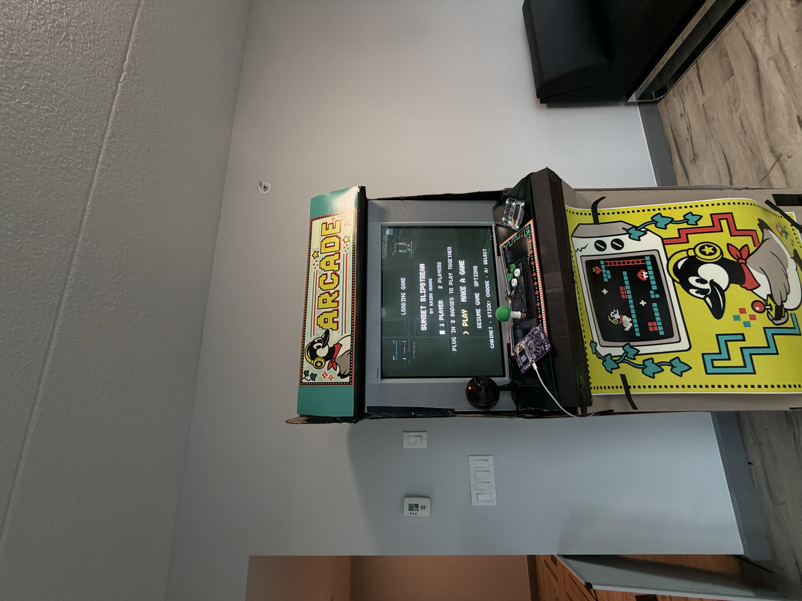

# murph-e

Hack the North 2026. Semifinalist — top 25 of 349 projects.

An arcade machine that creates any game you describe, live, and lets you play it with a hacker badge. [Devpost](https://devpost.com/software/arcade-l34jba).



| Building the cabinet | On the expo floor |
| :---: | :---: |
|  |  |
|  |  |

- `docs/overview.md`: background, what we are building, decisions so far.
- `docs/goals/`: what tier 1, 2 and 3 look like when done.
- `docs/plans/tier-1.md`: the implementation plan for tier 1.
- `docs/harness-plan.md`: the generation pipeline design and its latency budget.
- `docs/badge-integration.md`: hacker badges as controllers and identity.
- `AGENTS.md`: conventions for anyone, human or agent, working in this repo.

## Inspiration

Murphy’s law says anything that can go wrong will go wrong. We borrowed the idea of possibility becoming reality and named our machine **murph-e**. Whatever arcade game you can think of, we want you to be able to describe it and play it.

A racing game with ridiculous rules, a platformer built around an inside joke, or something you and a friend just came up with. The idea is yours. The machine figures out how to make it playable.

We built both the software that generates the games and the physical machine you play them on, starting with an old CRT, salvaged joystick parts, and a steel tire rack.


## What it does

- Hold TALK and describe a game. Review what the machine heard, then start generation.
- Watch the game description and code appear while the system builds and tests it.
- Play solo using our homemade joystick and buttons, or plug in two Hack the North badges for multiplayer.
- Browse games other people have created, see their creator credits, and try to beat their scores.

A Lua app on the badge turns it into a controller. It sends button presses plus the player’s name and badge ID, so scores stay attached to people across sessions. The badge screen also shows their player number and the controls for the current game.





## How we built it

**Software**

- Next.js, React, and TypeScript for the cabinet interface.
- A small game runtime with a 256 × 224 canvas, pixel sprites, synthesized sound, scoring, and shared input handling.
- A generation pipeline that transcribes speech, writes a structured spec, and uses OpenAI models to emit `game.js`.
- A local catalog of tested foundations, sprite data, and mechanic guidance. Optional TypeSafe Jev selection picks a foundation and settings before Astra writes code.
- Generated games run in sandboxed iframes. Playwright checks that they run and respond to controls in both solo and two-player modes. One bounded repair is allowed if a check fails.
- SQLite indexes reusable game material and generation history. Scores and creator credits show up in the library.

**Hardware**

- A 27 inch Sony Trinitron CRT, with the UI designed for its 4:3 screen.
- A steel tire rack cut and modified into the cabinet frame.
- An analog joystick desoldered from an existing controller, then a larger assembly designed in SolidWorks and 3D printed with the buttons.
- Circuitry designed in KiCad. ESP32 firmware calibrates the stick, debounces buttons, and reports input as a USB gamepad.
- The badge USB application-transfer protocol installs our Lua app when a player plugs in.


## Community website

The separate gallery and global leaderboard live in [`apps/web`](apps/web/README.md).
Run `pnpm dev:web` for http://localhost:3020. Deploy it as a new Vercel project with
root directory `apps/web`; it uses only the public Supabase URL and publishable key.
See [the data flow](docs/plans/community-arcade.md) for score saving and migrations.

## Run locally

Use Node 24+ and pnpm 11. Run from the repository root:

```sh
pnpm install --frozen-lockfile
pnpm catalog:rebuild
```

For a fresh checkout, copy `.env.example` to `.env`; keep your existing `.env`
when updating. Configure these server-side settings before starting the cabinet:

| Setting | Purpose |
| --- | --- |
| `OPENAI_API_KEY` | Game generation and the default OpenAI speech transcription. |
| `HTN_JEV=1` and `TYPESAFE_API_KEY` | Optional Jev foundation/settings selection before Astra writes code. The example opts into this mode, so both provider keys are required. |
| `HTN_JEV=0` | OpenAI-only generation with the normal local catalog selection; no TypeSafe key needed. |
| `HTN_STT=local` | Optional offline speech recognition; requires the setup below. |

```sh
pnpm dev
```

Open the localhost URL printed by the server. Speech defaults to OpenAI
`gpt-4o-mini-transcribe`; `HTN_STT_MODEL` overrides the API transcription model.
Hold SPACE/TALK, release, review the transcript, and select CREATE GAME.
The microphone is off between recordings.

For offline speech, install Python 3.9+, run `pnpm stt:setup`, and set
`HTN_STT=local` in `.env`. Setup creates `.venv-stt` and downloads faster-whisper's
`tiny.en` English model into `.models/whisper-tiny.en`. Subsequent transcription
runs locally on CPU with int8 computation. Restart the server after changing
environment settings. Local speech and existing games work without an API key.

People using the cabinet generate games through the OpenAI API, using
`OPENAI_API_KEY` in the repo's gitignored `.env`. Assistant development, base-game
authoring, iteration and testing use the user's **Codex subscription (Astra medium)**
and offline tools. Developer CLI model calls are blocked, even with a saved key.
Only the cabinet's generation and speech routes open the app request scope. Do
not use those routes to bypass the developer restriction. See [the billing rule](AGENTS.md).

## After pulling updates: rebuild the local database

Run these commands after pulling catalog or component changes from `main`:

```sh
pnpm install --frozen-lockfile
pnpm catalog:rebuild
```

The rebuild runs offline with no model requests or API keys. It creates or
refreshes `data/catalog.sqlite`, indexing verified foundation packs, sprite
records and components extracted from committed game sources. It also includes
saved runs and local catalog sources already present on your machine. You can
rerun it without deleting existing component history.

Immutable source copies live in `data/components/`; the command writes its
inventory report to `data/components/inventory.json`. These files and the SQLite
database are gitignored, so they are **rebuilt locally, not downloaded from Git**.
A fresh checkout has fewer historical components than a machine with private
generation runs. API keys, private runs and optional local assets stay local too.

Verified factory files remain the source of truth and work before the SQLite
inventory is built. Extracted fragments need review before reuse; indexing them
does not make them verified game components. See the
[component reuse guide](docs/plans/reusable-components.md) for search/export
commands, provenance and verification, and the
[database schema](docs/reference/catalog-schema.sql) for the index structure.

## Local game library

The catalog includes 16 verified arcade foundations: fighting, kart
racing, momentum platforming, maze chase, barrel climbing, Pong, Breakout,
formation shooting, Asteroids-style shooting, missile defense, road/river
crossing, bomb arenas, falling blocks, plane racing, the Ember Watch arena shooter
and the Keystone Keep dungeon shooter. Fifteen support both solo and local
two-player play. The historical Sky Racer is solo-only and excluded from new
generation, which requires both player counts from the start.
Browse with the controls or swipe; the gameplay preview stays separate from the
real game, which waits for PLAY. New and revised local packs refresh in the menu.

Generation retrieves relevant verified factory contracts and compatible sprite
sets, then links their code and animation data into the model's customization.
The [catalog guide](library/catalog/README.md) explains admission and reuse.
The shared [sound bank](docs/sound-effects.md) supplies event cues and custom tones.

SQLite stores the local index and quarantined generation history; see the
[inventory/audio audit](docs/catalog-and-audio-audit.md) for background.
`node scripts/catalog-snapshot.mjs` exports a read-only snapshot once indexed.

Optional source-art adaptations under ignored `data/local-catalog/` require
separate local installation. Their downloaded commercial sprites are not included
in Git or needed to run the committed foundations. Local speech models and secrets
are also excluded from Git.

## Generation models and context

Each request generates **one game that supports both solo and local two-player
play**: one spec, one optional Jev selection, and one Astra build. The same code
is tested in both modes, with at most one repair if validation fails. Changing
player count reuses the saved game; it does not start another model request.

In the app, game writing and repair use `gpt-6-astra` at medium reasoning effort.
The historical CLI-only remix path is blocked for developer use.
The short structured spec uses `gpt-5.6-luna`. With `HTN_JEV=1`, Jev then selects
an eligible verified foundation and optional settings; Astra still writes and
repairs the game code. With `HTN_JEV=0`, the normal deterministic catalog selection
remains available. See the [Jev integration guide](docs/plans/jev-experiment.md).

Spec and code generation receive local
[arcade design guidance](docs/research/arcade-context/README.md): a shared core
and up to four relevant mechanic cards, with no extra model call or search service.
Every attempt saves its selected cards, source URLs and prompt text in `runs/`.
Set `HTN_DESIGN_CONTEXT=0` and restart to compare without that guidance.
See [the benchmark report](docs/bench-2026-09-19-astra-medium.md) for measured results.

Targeted [implementation references](library/reference/README.md) supplement the
design cards for maze chase and combat requests. The planner gets the structural
contract; build and repair also get original, tested code and available pixel sprite
data. Set `HTN_REFERENCE_CONTEXT=0` to compare without this layer. This does not
fetch external sprites or introduce a new runtime API.
