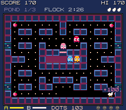

# Astra medium and local implementation references — 2026-09-19

The user requested Astra medium and more concrete generation context after audits
of DC DUEL and GOOSE CHASE found weak art, mismatched attack timing, a missing
visible ghost house, and a changed user objective.

## Final configuration

- Build and full-file repair: `gpt-6-astra`, reasoning `medium`.
- Planner remains `gpt-5.6-luna`, reasoning `none`; CLI remix remains Astra low.
- Build output allowance: 20,000 tokens, including reasoning and code.
- Full build/repair deadline: 300 seconds; cancellation remains immediate.
- Incomplete Responses streams retain usage and return an explicit validation
  error, even if their partial JavaScript happens to parse. Both pipeline and
  benchmark reject that error before accepting a game.
- Cabinet restarted and a subsequent live request logged build/repair medium.
  Budget changes after that restart are picked up by the Next development server.

## Context changes

`library/reference/` contains original project code, not original commercial ROM
source or a downloaded sprite archive. The planner receives relevant contracts;
build and repair additionally receive the code. Selection works independently
of exact genre labels; unrelated games keep their own genre and mechanics.

- Maze: original 19x19 layout with a visible house, ghost-only door, paired
  tunnels, reachable pellet cells, separate ghost slots, timed exits and a
  capture/return/reform/release lifecycle. Includes two original animated ghost
  pixel frames directly usable by the runtime.
- Combat: startup/active/recovery shared by pose selection and hitboxes, one hit
  per target per attack, directional guard, hitstun, knockback and explicit
  integration responsibilities. This is a component example, not a full fighter.
- New specs record `referenceIntent.reference`, `.preserve`, and `.change`.
  A focused test initially restored standard Pac-Man behavior despite a goose
  hunting ghosts request. The explicit adaptation contract was added in response;
  subsequent specs preserve permanent hunting and ghost evasion. Legacy specs
  without this field remain readable.
- Exact reference text, IDs and hash are stored in `implementation-context.json`.
  `HTN_REFERENCE_CONTEXT=0` provides an ablation switch.

No PNG atlas API, external sprite downloads, automatic visual judge, semantic
playtest agent, training, or full game-engine replacement is included here.
The 256x224 display and fixed 16-color runtime remain unchanged.

## Benchmark interpretation

These are specification plus one builder call, not the cabinet's two-candidate
race or repair path. Benchmarks overlapped, some prompts were retried after budget
changes, and the prompt/context changed along with effort. This is regression and
failure analysis, not an isolated causal comparison of reasoning settings.
Latencies below are for completed responses only; timeouts are separate failures.
The benchmark's `13/13` probe summary excludes errors: it means **13/20 overall**,
not 100% request success. Older truncated responses show zero usage because the
previous handler ignored `response.incomplete`; those zeroes are not actual usage.

| Configuration / batch | Completed-response p50 / p95 | Overall first-pass result |
| --- | --- | --- |
| Prior low, 20 one-player prompts | 84.6s / 124.1s | 18/20 |
| Prior low, 12 two-player prompts | 92.5s / 121.7s | 10/12 on the then-current probe |
| Initial medium + references, 180s / 12k, 20 one-player prompts | 162.7s / 180.0s | 13/20; 7 build deadlines |
| Initial medium + references, 180s / 12k, 12 two-player prompts | 162.9s / 177.1s | 7/12; 5 build deadlines |
| Medium, 300s / 12k, 3 two-player timeout retries | 244.4s / 272.9s | 2/3; one truncated game |
| Medium, 300s / 12k, remaining frog retry | 234.6s / 234.6s | 1/1 |
| Medium, 300s / 12k, 4 focused retries | 233.4s / 254.6s | 1/4; three truncated games |

The old deadline was too short for a significant portion of medium builds.
Extending it exposed the next problem: output ending mid-function under the old
12k allowance. The final allowance is 20k and the stream handler now explicitly
handles incomplete responses. Final targeted results are recorded below.

### Final 20k / 300s targeted checks

| Prompt | Total / build | Output tokens (including reasoning) | Result |
| --- | --- | --- | --- |
| Pac-Man with a goose hunting ghosts | 283.1s / 271.2s | 14,430 (4,142 reasoning) | Runtime probe passed; 906 lines |
| Co-op zombie survival with a shotgun, 2P | 289.7s / 280.7s | 13,522 (2,335 reasoning) | Runtime probe passed; 840 lines |
| Street Fighter with Batman, Superman and Flash | Build exceeded 300s | Unavailable on deadline | Failed; no completed game |

Overall: **2/3 first-pass requests succeeded**, not 100%. These are three targeted
retries, not a repeat of the complete regression suite or a latency distribution.
Raw reports: [quality](../bench/results/2026-09-19-2047-astra-medium-20k-quality.md)
and [2P](../bench/results/2026-09-19-2047-astra-medium-20k-2p.md).
The successful builds exceeded the previous 12k allowance. The fighter deadline
remains unresolved; medium does not make elaborate one-shot generation dependable.
Time to first code was also long: 124.2s for the maze and 87.3s for the shooter.

The final maze was rendered at frames 1, 240 and 480 using the isolated runtime.
It has a visible central house and separate ghost slots; ghosts move out onto the
maze. Code inspection confirms body contact always captures ghosts, capture scores
once per release, eyes return to the house, and a clock rather than ghost contact
costs a life. Its planner still emitted a contradictory contact-loss rule despite
the correct `referenceIntent`; the builder explicitly resolved this in favor of
the user's reversal. This is an observed success of the priority instruction,
not evidence that planner contradictions are eliminated.

The maze probe recorded no visual change for three held directions from its
starting position (a corridor), while another direction changed the game and the
aggregate probe passed. This is not a complete maze navigation or completion test.

## Verification and limits

37 harness tests pass, including reference-code behavior, prompt handoff,
legacy-spec compatibility, medium request parameters, incomplete-stream handling,
and deadline/cancellation. Harness and cabinet TypeScript checks pass.

The initial focused maze render has a visible central house with separate waiting
ghosts, tunnels and a substantially more recognizable maze topology:
`bench/audits/medium-references/initial-maze/goose-chase-start.png`.
That first sample still had the wrong hunting objective, so it is evidence of
structural improvement only. It is not the final intent-preserving sample.

Automated probes remain basic runtime/input checks. These results do not establish
fun, faithful named-character art, complete spec compliance, or a calibrated visual
quality gain. Prepared animation assets and stronger semantic playtests remain
separate work. The new latency is a material departure from the original cabinet
speed target and a tradeoff of this medium configuration, not a demonstrated
improvement in the cabinet experience.
