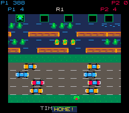
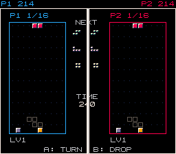
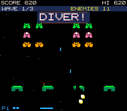
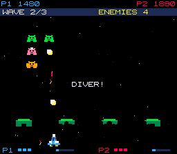
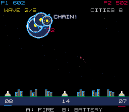
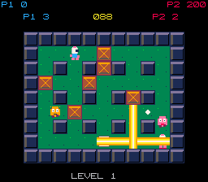
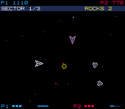

# Expanded catalog generation benchmark — 2026-09-19

Twelve actual Astra generations: six prompts × 1P/2P, one sample per prompt/mode. All twelve compiled and passed the repository's runtime probe. Eight also completed their requested objectives in longer native-runtime input replays. This is evidence for composing these six known foundations, not for arbitrary-game quality or human difficulty balance.

These are **frozen v4.2 prompt-guidance samples**. The root task subsequently tightened factory-default authority and bumped guidance/cache keys to v4.3. That later change does not repair these saved cartridges or make this a v4.3 benchmark. No model setting or catalog source changed during these runs.

## Setup and results

Actual build model: `gpt-6-astra`, reasoning `medium`. Planner: existing `gpt-5.6-luna` configuration. Concurrency 2, one generation per prompt/mode. Existing environment key used without printing it. Six prompts in [prompts-catalog-expanded.txt](../bench/prompts-catalog-expanded.txt) requested supported configuration plus small notices, color changes or framing.

```sh
pnpm harness bench bench/prompts-catalog-expanded.txt --players 1 --concurrency 2 --label catalog-expanded-medium-1p-unique-a
pnpm harness bench bench/prompts-catalog-expanded.txt --players 2 --concurrency 2 --label catalog-expanded-medium-2p-unique-a
```

| Metric | 1P | 2P |
| --- | ---: | ---: |
| Actual generations | 6 | 6 |
| Errors / syntax errors | 0 / 0 | 0 / 0 |
| Probe passes | 6/6 | 6/6 |
| Total p50 / p95 / max | 14.2 / 29.0 / 29.0 s | 20.5 / 32.1 / 32.1 s |
| Build p50 / p95 | 6.0 / 17.0 s | 13.8 / 23.2 s |
| First build token p50 / p95 | 3.4 / 10.4 s | 9.4 / 16.3 s |
| Mean output / reasoning tokens | 388 / 136 | 524 / 214 |
| Batch wall clock | 56.1 s | 82.7 s |

The tiny sample's percentile estimates are descriptive only. CLI total measures that run's generation path; batch wall time includes concurrency and verification. Token counts are model output, while reported line counts include linked foundation code.

Raw records: [1P JSON](../bench/results/2026-09-19-2145-catalog-expanded-medium-1p-unique-a.json), [1P summary](../bench/results/2026-09-19-2145-catalog-expanded-medium-1p-unique-a.md), [2P JSON](../bench/results/2026-09-19-2147-catalog-expanded-medium-2p-unique-a.json), [2P summary](../bench/results/2026-09-19-2147-catalog-expanded-medium-2p-unique-a.md).

## Contract and semantic review

All twelve selected the correct verified family. No unsupported top-level factory option was found. Player count remained cabinet-owned; no wrapper created extra players or replaced foundation controls. All requested HOME/DIVER/CHAIN notices used real hooks and awarded no extra points. The unrequested Asteroids split bonus is a separate exception described below.

| Family | Actual customization | Result and caveat |
| --- | --- | --- |
| Bomber | `levels:2`, `lives:3`, `roundSeconds:90`, capacity 2, density .25/.24, co-op, no teammate damage | Code follows request. The 2P planner incorrectly says “Clear 3 arenas” in its final mechanic although the wrapper correctly uses two. |
| Crossing | 3 levels, 4 lives, .85 lane speed, sinking turtles, HOME hook | 1P notice uses the middle safe bank. **2P notice covers the time counter** at y211. Planner's 2P loss text says final-level expiry ends the game; actual foundation timeout costs each living player a life and restarts the clock on every level. |
| Falling blocks | 16-line goal, equal seed 7, `garbage:false`, on-clear pulse | Actual controls, bag order, goal and scoring preserved. Pulse surrounds whole screen/half instead of the requested well border. **2P's added divider at x127/128 cuts through the shared NEXT/TIME text.** |
| Formation shooter | 3 waves × 3 rows × 6 aliens, 3 lives, bunkers, purple/cyan accents, DIVER kill hook | Both modes clear exactly 54 aliens. 1P banner is unusually large (106×23 px, double-size text) compared with compact 2P notice, but observed frame did not cover the score HUD. 1P loss prose incorrectly refers to “both cooperative players”; actual cartridge remains 1P. |
| Asteroids | 3 sectors, 4 initial large rocks, zero drag, 3 lives, white/cyan accents | Mechanics match. **1P planner invents a split bonus**, and builder adds 10 points after every real large/medium split. It is not a duplicated collision award, but it changes scoring without the user asking. Native run had 45 such bonuses = 450 extra points. 2P has no such hook. |
| Missile defense | 5 waves, CHAIN interception hook, independent 2P cursors/shared ammo | Both clear five waves. 1P puts notice centrally; 2P reads real explosion/cursor positions for compact feedback. No extra scoring or observed notice/HUD collision. |

The lessons are specifically: constrain planner claims to the selected factory and user's requested deltas; reserve and expose overlay-safe geometry; test callbacks when they occur, not only during startup. A probe pass alone cannot detect these prose/rule mismatches or visual occlusions.

The probe's soft no-motion observations were geometrically explainable: Bomber directions pointing into spawn walls, crossing DOWN from the bottom row, and braking a stationary Asteroids ship. They were retained in the raw benchmark; they were not hidden or treated as evidence of missing controls.

## Longer replay evidence

[Audit script](../bench/results/catalog-expanded-medium-audit-a/audit.mjs) reads the exact saved `game.js`, plans ordinary joystick/button transitions from detached `inspect()` snapshots, and replays those transitions into the **unchanged cartridge** in isolated headless Chromium. No game-state setters, teleports, asset substitution, scene redraws or additional model calls. Browser screenshots use the runtime's native 256×224 framebuffer, not an offscreen page screenshot. [Full audit JSON](../bench/results/catalog-expanded-medium-audit-a/audit.json) records source/spec/customization hashes, selected pack hashes, inputs, observed state, score calls, callback frames, native snapshots and limits.

| Generated cartridge | Native replay outcome | Evidence |
| --- | --- | --- |
| Bomber 1P | Lost at frame 1327; score 480 | Moves, plants, escapes and destroys crates/monsters; the simple pilot did not complete either arena. |
| Bomber 2P | Lost at frame 761; scores 60 / 200 | P2 independently moves and plants at opening; subsequent pilot controls P1. This is not a full co-op completion test. |
| Crossing 1P | Playing after 198 frames; score 388, 4 lives | One real home reached across traffic and moving river support. |
| Crossing 2P | Playing after 198 frames; scores 388 / 0, 4 lives each | First-home callback and independent second frog present; longer multi-level/P2-home route not claimed. |
| Falling blocks 1P | Win frame 834; score 5386 | 16 lines, 45 legal locks/hard drops, 37 rotations. |
| Falling blocks 2P | Shared win frame 834; 5386 / 5386 | Both 16 lines, identical piece sequence, no garbage sent/received. |
| Formation 1P | Win frame 3061; score 6530 | 54 kills, 3 waves, 8 dives, 1 UFO, 1 life lost. |
| Formation 2P | Win frame 1465; scores 2910 / 4010 | 54 kills, 3 waves, 4 dives; both contribute. |
| Asteroids 1P | Win frame 2977; score 9750 | 105 rock kills, 45 splits, 3 sectors, 5 hyperspaces, 2 hits; includes 450 invented bonus points. |
| Asteroids 2P | Win frame 1737; scores 5900 / 4900 | 105 rock kills, 45 splits, 3 sectors, 6 hyperspaces, 2 hits. |
| Missile defense 1P | Win frame 4415; score 3958 | 5 waves, 81 interceptions, 9 chain kills, 1 actual fork split, all 6 cities survive. |
| Missile defense 2P | Win frame 4392; scores 2784 / 2759 | 5 waves, 39 shots/40 interceptions each, 7 chain kills, all 6 cities survive. |

All twelve native replays had no runtime error and their final scores exactly matched the VM input-planning trace. Eight native sessions reached the requested win; Bomber difficulty and three-level crossing completion are explicitly unresolved by this generated-output audit. Foundation admission has separate tests, which are not a substitute for testing these specific generated wrappers. Input policies are intentionally competent, not human playtests or fairness measurements. Crossing search was bounded to four opening attempts/1400 search nodes to prevent an audit search consuming unbounded time.

## Native screenshots inspected

The 2P crossing HOME notice covers the time digits:



The 2P falling-blocks divider intersects shared NEXT/TIME text:



Actual DIVER and CHAIN callbacks:





Actual bomb blast and Asteroids co-op action:




These artifacts were reviewed at native resolution. They are original foundation graphics, not imported commercial sprite sheets. The screenshots show a narrow set of actions, not exhaustive animation/CRT/hardware coverage.

## Frozen source hashes

Every run has its own unique source directory under `runs/<runId>`; no old source was overwritten. Complete run IDs, customization/spec hashes and all linked pack hashes are in audit.json. SHA-256 of each exact saved bundled game:

| Family | Players | SHA-256 |
| --- | ---: | --- |
| Bomber | 1 | `a6e6d46ec1267848970bf3ea88931e9f768bf46c7416026920cb608c3190c151` |
| Crossing | 1 | `ecb60f85fa5382ebeed6fbc62a74c52d7d13e91816a2e68497c41fe5e9932660` |
| Falling blocks | 1 | `ed69fcf9ab520d7980e270b14453743fe8576228b62e06e92ed364f7c3912d7b` |
| Formation shooter | 1 | `96f59e40dda2e1d08d6e57e36bfe43296b53f850ab26fcaec66cea09ea30d90a` |
| Asteroids | 1 | `e427d33e2ace8f78b6a485320e2fb70bee27751e0d6ad11468465dbe0ee8ff9b` |
| Missile defense | 1 | `916d1cd0e7f528fae9435f818297ca5635c41d098396ca0d28ad426dd11996a4` |
| Bomber | 2 | `3a0af0911e3cc2f16e18a0448ae9d6e951d6a35988100b47c7434e086d15822c` |
| Crossing | 2 | `bb02489bbb28b2377b712db438ef11789b28b26716f806a95a86a125c29cfc34` |
| Falling blocks | 2 | `e53d493d23aeebbc90d1a5f397d4517421c84330abb34c9f065d9ceab4192a9c` |
| Formation shooter | 2 | `29555026b67d196a0d9971c6dadded97b1698551ca719eb18979e5c5aa8620b1` |
| Asteroids | 2 | `c3a910844d6bfe3ed14393a25bf93119e1f4c001f4f135dff6c06fc1a6806e1f` |
| Missile defense | 2 | `ba92c30d3f8781f613946390f3ecbb42e63a0429643e258d305d1374499acec3` |
