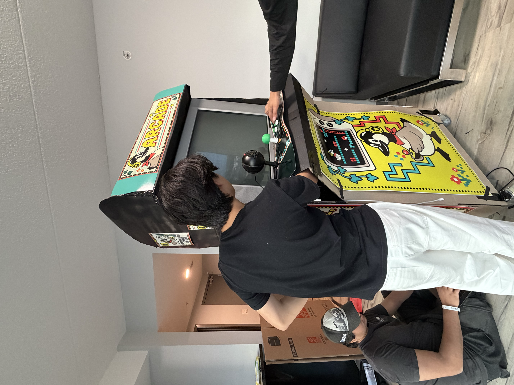
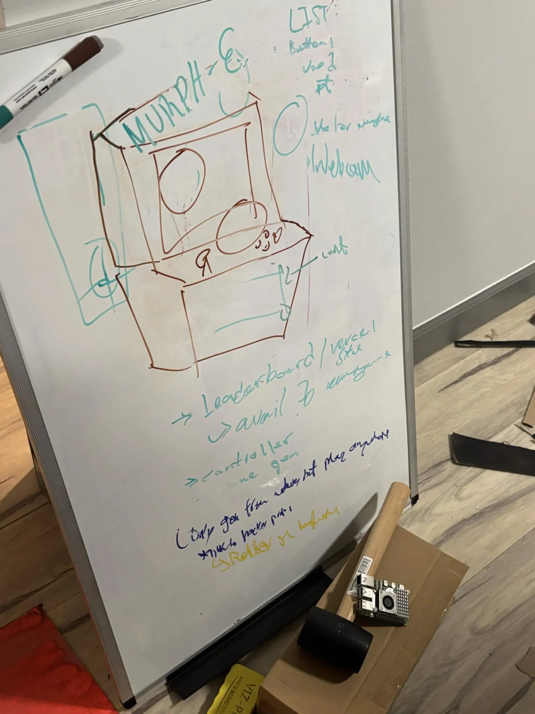
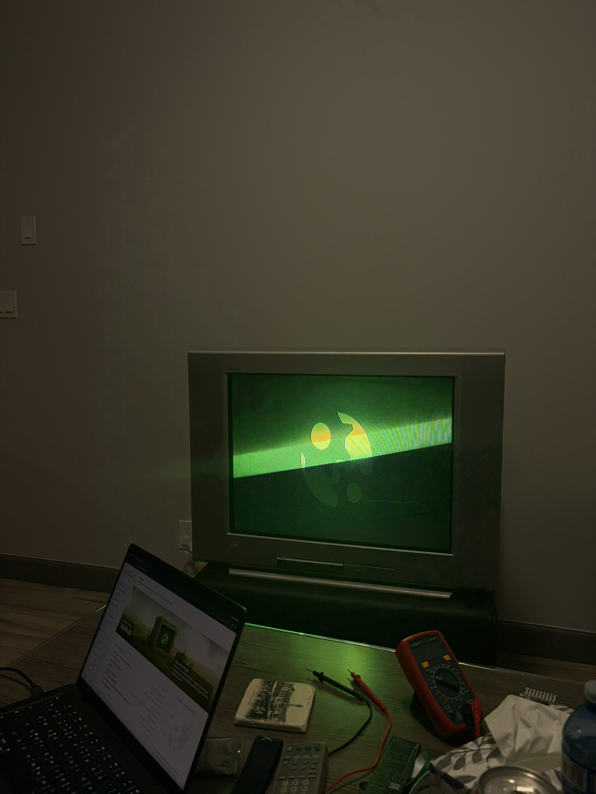
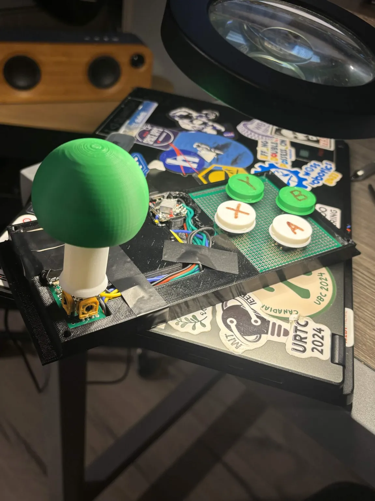
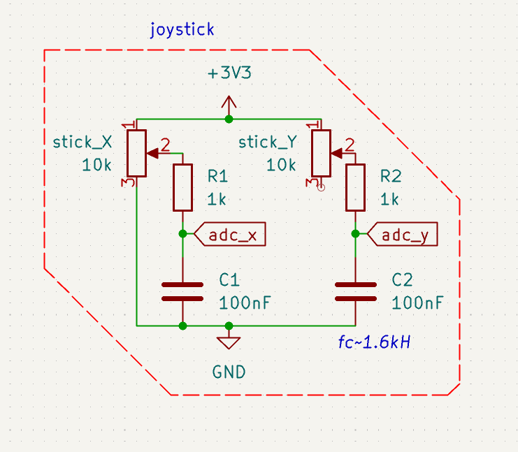

# murphe

## Inspiration

Murphy’s law says anything that can go wrong will go wrong. We borrowed the idea of possibility becoming reality and named our machine **murphe**. Whatever arcade game you can think of, we want you to be able to describe it and play it.

A racing game with ridiculous rules, a platformer built around an inside joke, or something you and a friend just came up with. The idea is yours. The machine figures out how to make it playable.

We built both the software that generates the games and the physical machine you play them on, starting with an old CRT, salvaged joystick parts, and a steel tire rack.

## What it does

- Hold TALK and describe a game. Review what the machine heard, then start generation.
- Watch the game description and code appear while the system builds and tests it.
- Play solo using our homemade joystick and buttons, or plug in two Hack the North badges for multiplayer.
- Browse games other people have created, see their creator credits, and try to beat their scores.

Our Lua app turns the badges into controllers. It reads button presses and sends badge profile information, including the player’s name and badge ID, to the machine. This lets us keep scores associated with players across sessions. The badge screen also shows their player number and the controls for the current game.

## How we built it

**The software**

- We used Next.js, React, and TypeScript for the interface.
- We built a small game runtime with a 256 × 224 canvas, pixel sprites, synthesized sound, scoring, and shared input handling.
- The generation pipeline transcribes speech, creates a structured game specification, and uses OpenAI models to write the code.
- A local catalog supplies tested game foundations, sprite data, and guidance for mechanics such as movement, combat, and scoring. Our optional TypeSafe Jev integration helps select a foundation and its settings.
- Generated games run in sandboxed iframes. Playwright checks that they run and respond to controls in both solo and multiplayer modes. If a check fails, the pipeline can attempt one repair.
- SQLite indexes the reusable game material and generation history. We also store scores and display game creator credits in the library.

**The hardware**

- We used a 27 inch Sony Trinitron CRT and designed the interface for its 4:3 screen.
- We cut and modified a steel tire rack to make the frame.
- We desoldered an analog joystick from an existing controller, designed a larger assembly in SolidWorks, and 3D printed the joystick parts and buttons.
- We designed the circuitry in KiCad and wrote ESP32 firmware to calibrate the joystick, debounce buttons, and report inputs as a USB gamepad.
- We implemented the badge’s USB application transfer protocol so the machine can install our Lua app when a player connects their badge.

## Challenges we ran into

- **Making games that were actually fun was hard.** Generating a good game usually takes iteration, clarification, and playtesting. We were trying to get from a spoken idea to something worth playing in one attempt, and getting that first version to feel really good is still difficult.
- **The badges and Lua apps were finicky.** We had very little memory to work with, and our choice of font ended up breaking the entire badge app. It took a while to understand why something as small as displaying text could cause it to fail. We eventually traced the failures to how the font was rendered and updated, then changed how we displayed the controls.

## Accomplishments that we're proud of

- Getting a spoken idea through generation and testing, then playing it with physical controls on a CRT.
- Building our own joystick assembly from salvaged parts.
- Turning the badges people already had into multiplayer controllers with names and game instructions on their screens.
- Building reusable foundations for racing, fighting, platforming, shooters, and puzzle games.
- Making each newly generated game support both solo and multiplayer without another generation request when switching modes.

## What we learned

- A small, consistent runtime makes generated code easier to check and integrate.
- Tested foundations give the generator reliable mechanics to build on.
- Automated checks catch crashes and broken inputs. Playing the game tells us whether the pacing and difficulty feel right.
- Physical testing matters. Our simulated badges couldn’t reveal every firmware limit, cable problem, or interaction between USB devices.

## What's next for murphe

- Shorten generation time and make the results follow spoken ideas more closely.
- Add more tested mechanics and game foundations.
- Let players request changes to a game through voice.
- Explore wireless badge controllers.
- Let people save and share the games they create, so they can keep playing after leaving the machine.
