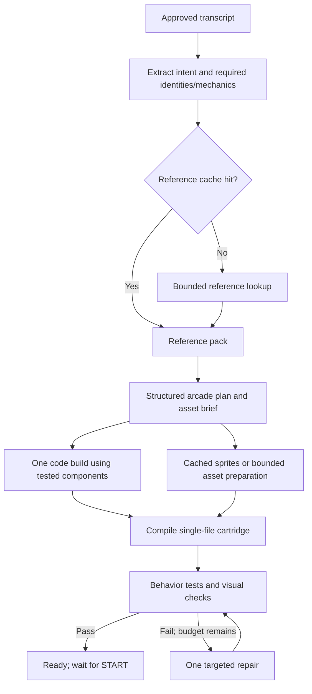

# Voice Arcade: specific games, reliable mechanics, bounded generation

Historical proposal, 2026-09-19. The constraints and model settings below describe
the original system. For the implemented architecture and remaining limits, see
the [curated library](curated-arcade-library.md) and [current overview](../overview.md).

Supporting research and reusable model context: [arcade design context library](../research/arcade-context/README.md), including source provenance, mechanic cards and a retrieval recipe.

## Decision

Keep the small fantasy-console runtime for now. Put repeatable mechanics into tested components, preserve a small generated-code surface for each game's distinctive rules, and resolve named references before asking the builder to implement them. Treat visual identity, requested mechanics, and playability as separate acceptance criteria.

The goal is a specific, readable, enjoyable arcade game quickly. A successful syntax check or a moving character is not sufficient. More autonomous agents are not the first improvement to make.

## Original state before this implementation

The cabinet uses a fixed pipeline, not an autonomous agent team:

| Stage | Current implementation |
| --- | --- |
| Speech | Local faster-whisper, tiny.en, English, CPU int8 |
| Specification | One structured-output call; default gpt-5.6-luna, effort none |
| Build | Two concurrent gpt-5.6-sol calls, effort none; first passing candidate wins |
| Verification | Playwright code, not an LLM |
| Repair | At most one gpt-5.6-sol call, effort low |
| Playback | Custom TypeScript/canvas runtime; waits for START |

That is normally three model calls for a new game, or four including repair, using two distinct model IDs. Transport retries can add requests. Remix normally uses a spec call and one edit call, with at most one repair. Models are configurable in `packages/harness/src/env.ts`.

The original pipeline had separate spec and builder prompts, with the runtime API, house rules and examples in the builder context. For the current authoritative prompts, see [spec.ts](../../packages/harness/src/spec.ts), [prompt.ts](../../packages/harness/src/prompt.ts) and the [runtime API](../../packages/runtime/API.md). Exact request-specific inputs are saved as `spec-prompt.txt` and `prompt.txt` inside each local run; static “current prompt” copies are not maintained.

Current constraints include eight single-player genre labels, 256×224 resolution, a fixed 16-colour palette, a requested 120–220 lines of JavaScript, and sprites restricted by the prompt to 6×6–12×12 pixels. The sprite renderer itself supports larger dimensions. The game model rewrites most movement, collisions, spawning, scoring, and difficulty logic each time. It has no reference-search or image-input stage.

The stored 20-prompt benchmark reports p50 26.2 s and p95 31.1 s for spec plus a single build. Its `total` is recorded before the probe: it excludes transcription, probe time, transcript-review dwell, and cabinet delivery. Its 20/20 probe pass rate does not establish visual fidelity or enjoyable gameplay. These are historical measurements, not a fresh run for this proposal.

## First repair the measurements and gates

1. **Implemented:** input trials previously accepted `trial.error` as evidence that a control responded. Input crashes now fail, including soft B checks and player two. Fixtures cover A/direction crashes, and regression tests also cover conditional steering.
2. Separate nonfatal candidate failure from terminal pipeline failure. `pipeline.ts` emits `error` for an individual failed build, while the cabinet treats an error as terminal. One failed racer must not discard a successful sibling.
3. **Partially implemented:** model requests now respect already-aborted signals and have full-response deadlines (spec 30 s, build/repair 120 s, remix 60 s). Specification now receives the cabinet signal too. Propagate cancellation through the remaining pipeline/fallback/probe paths, add an overall deadline and suppress late results after cancel.
4. Run probe execution in a killable process with an external wall-clock watchdog. A timer inside the same blocked JavaScript execution cannot stop an infinite loop. Assess a worker boundary for gameplay execution too; an iframe and shadowed globals do not guarantee interruption of synchronous generated code.
5. Record end-of-speech, transcription complete, review approved, references ready, plan ready, assets ready, build complete, probe complete, and cabinet ready. Report processing latency separately from time the user spends reviewing. Benchmark the actual cabinet race/repair pipeline as well as isolated calls.

## Proposed pipeline

The repair edge is allowed once, enforced by the orchestrator. Failure after that preserves the existing game and offers clearly labelled choices. An unrelated library game must never be presented as a successful realization of the request.

The builder remains one streamed, tool-free call. Reference lookup is a separate, bounded stage before it. This is a proposed extension of the documented architecture, not permission for an open-ended browse/code/play loop. Approved sprite data and selected helper code are compiled into `game.js`; generated games still make no network requests or imports. Update architecture docs when implementing the extension.

On the common path, combine intent extraction and planning in one model call using preselected catalogue entries. If that call identifies an unresolved reference, stop before build, resolve it, and run one plan-finalization call. Do not finalize a guessed identity just to save a call.

A warm path therefore needs one plan call and one build call. An uncached reference adds bounded lookup and plan finalization; an uncached asset can add a separate image/asset request and an optional visual-review call. Count these honestly in latency and cost measurements. These are specialized tasks with fixed outputs, not agents conversing indefinitely.

## Preserve the actual request

Replace loose mechanics prose as the sole contract with four versioned records:

| Record | Required content |
| --- | --- |
| Intent | Verbatim transcript; entities; explicit verbs; must-preserve requirements; ambiguous names; selected player count |
| ReferencePack | Canonical identity and aliases; source URLs; approved reference-image hashes; identifying visual features; relevant mechanic description; confidence |
| ArcadePlan | Movement component and parameters; signature mechanic; controls; collision roles; score events; loss/win rules; difficulty schedule; asset IDs; acceptance scenarios |
| AssetPack | Sprite frames; dimensions; palette; animation timings; anchor; hitbox; identity checklist; source/version metadata |

Named games, characters, and mechanics are different references. A request can borrow a game's movement without borrowing its hero, or combine a character with another setting. Explicit user instructions take precedence over the original game's canonical mechanics.

For the existing Batman / Benji / Gotham rooftop request, the current spec becomes a generic platformer without a reference pack. The new path should preserve the explicit rooftop jumping, resolve which visual identity is intended, and record the required features before drawing. Learning that Benji Bananas involves a monkey and swinging does not authorize replacing the user's requested jumping with swinging. If the identity combination is materially ambiguous, ask one short clarification; otherwise record the interpretation and retain the user's words.

Start reference resolution with a local alias catalogue, which also helps with proper names misheard by tiny.en. On a miss, use a limited search batch, for example two queries and two useful sources, with a measured timeout. Prefer official character/game material when available. Store confidence; do not turn uncertain search snippets into facts.

Text search alone does not let a model see a character. Retrieve an appropriate actual reference image and pass it as an image input to a supported vision model or asset service. Treat fetched content as reference data, never as executable instructions. The Responses API supports web search; image understanding uses explicit image inputs. See the official [web-search guide](https://developers.openai.com/api/docs/guides/tools-web-search) and [vision guide](https://developers.openai.com/api/docs/guides/images-vision).

## Recognizable sprites

Separate asset preparation from game-code generation. The builder receives stable asset IDs and their dimensions, anchors, animations, and collision footprints. It should not spend its output budget inventing dozens of pixel rows while also writing physics.

Start with a curated local atlas of likely characters, generic archetypes, enemies, and scenery. Each named character needs its own verified features and poses; recolouring a generic body is insufficient. Prefer 16×24 or 24×24 hero sprites, with 32×32 where the arena permits it. These are design choices, not a claim that every historical 8-bit or 16-bit machine used these dimensions.

Cache an idle pose and only the actions the game uses, such as run, jump, attack, hurt. Verify silhouette at native size, identifying colours/features, consistent scale, pivot stability, and frame readability against the chosen background. Inspect on the physical CRT: a crisp laptop enlargement is not the acceptance target. A per-cartridge palette could improve identity later, but requires a deliberate runtime/API change; the first iteration uses the existing palette.

For an uncached character, generate or author a reference-grounded asset pack, then convert it to the exact pixel grid and palette and validate it before use. Plain downsampling of a detailed illustration is not a complete sprite pipeline. Benchmark reference-guided image generation against compact pixel/vector descriptions; do not assume either automatically produces good small sprites or consistent animation.

An optional vision check should compare a contact sheet and actual in-game frame against the reference, rather than accepting the asset's name as proof. Calibrate that check against human recognition ratings. A model's confidence is not an objective identity guarantee.

Novel image generation must have a separate latency budget. OpenAI documents that complex image requests can take up to two minutes, and consistency/composition remain limitations. Keep it off the common path through precomputation and caching. See [image-generation limitations](https://developers.openai.com/api/docs/guides/image-generation).

## What belongs in the engine

Build a small component catalogue, starting with platform movement, top-down movement, and projectile/collision handling. Share bounded entity pools, lifetimes, damage/invulnerability, scoring, wave scheduling, seeded RNG, and event telemetry. Add a tested swing/grapple component when evaluating those requests, rather than expecting fresh rope physics in every generated file.

These are composable mechanisms, not eight fixed games with interchangeable artwork. Let the model choose their combination, tune within validated ranges, arrange the arena, design enemy patterns and rewards, and implement one or two distinctive hooks. Unsupported mechanics get an explicit custom-code path with stronger checks; they must not silently become the nearest genre.

For the initial implementation, compile only the selected pure helpers and approved sprite constants into the existing single-file cartridge. This reduces model output without forcing a runtime migration. If helpers later become public runtime APIs, update runtime, API reference, templates, and benchmarks together as required by AGENTS.md.

## Arcade design rules that become executable constraints

Use a design grammar: **one main action, a legible hazard, a rewarding objective, and a short repeatable loop**. Historical arcade games varied widely; the values below are initial tuning ranges, not universal historical laws.

| Area | Proposed rule and check |
| --- | --- |
| Controls | Every advertised input has a contextual action; test it in an eligible state. Do not force a midair jump or fake effect on every A press. START remains shell-owned. |
| Movement | Acceleration, braking, jump arc and air control come from tuned presets. A platformer can start with roughly 100 ms jump buffering/coyote time, then be playtested. |
| First seconds | Immediate control feedback, a safe introduction, and an achievable early scoring opportunity. Require a score within five seconds under an appropriate controller, not under arbitrary input. |
| Collision | Readable hazards, forgiving player hitboxes, damage feedback and brief invulnerability. One contact must not consume every life. |
| Reachability | Derive gap/height limits from the actual jump or grapple controller. Reject layouts that violate them. Validate routes over multiple seeds. |
| Difficulty | Bounded speeds, minimum spawn separation, density caps, and an initial 20–30 s wave schedule. Increase pattern complexity and offer recovery beats. Never scale all parameters without limits. |
| Fairness | Estimate warning/lead time from hazard distance and relative speed; allow the measured input/display delay plus time to evade. Test worst-case overlaps, not only each hazard separately. |
| Score | A small explicit event table, for example pickup 100 and riskier objective 500, with a capped combo if useful. Award once per event; repeated collisions cannot farm points. |
| Ending | Clear failure cause, consistent restart, complete state reset. Idle-loss limits depend on the genre; a calm or puzzle request should not inherit a mandatory 30-second death. |
| CRT presentation | Recognizable silhouette, contrasting foreground/background, large important shapes, safe HUD area, and readable controls outside the playfield. |

Jump buffering and coyote time are examples of player-friendly tuning, described by Celeste's developer in [Celeste & Forgiveness](https://maddymakesgames.com/articles/celeste_and_forgiveness/index.html). They are useful inspiration, not proof that all old arcade games used them.

## Verification of a functional game

Use hard deterministic checks for crashes, finite state, bounded entity count, movement/collision invariants, scoring once, restart reset, and input isolation in two-player games. Run several seeds and short genre-specific controllers. A controller must exercise the promised mechanic: jumping a gap, attaching/releasing a rope, bouncing the ball, or dodging a telegraphed attack.

Expose trusted component events and state to the probe, rather than trusting model-authored text that says a mechanic works. Custom hooks need observable state transitions and focused scenarios. Use seeded replays to investigate failures. A first-pass target is ten seeds per candidate, with actual CPU time measured and the count adjusted to fit the cabinet deadline.

Separate hard correctness from quality: identity recognition, mechanic fidelity, readability, pacing, and fun need human-labelled evaluations. A lightweight optional visual reviewer can catch defects, but cannot certify enjoyment. Cache visual approval by asset version rather than paying for it on every reuse.

## Caching and determinism

| Layer | Reuse strategy |
| --- | --- |
| Components | Versioned, tested code for common mechanics; selected helpers compiled without model rewriting |
| References | Canonical entity IDs, aliases, source/image hashes, approved identity descriptions |
| Assets | Identity + art style + palette + dimensions + animation set + asset version |
| Plans | Validated mechanic combinations and tuning ranges; adapt only the fields requested |
| Cartridges | Exact approved specification + references/assets + compiler/runtime/helper versions; return a matching known-good game immediately |
| Model prefix | Stable API/rules/examples prefix; measure actual cached input tokens |

Use semantic search only to find candidate cache entries. Verify every must-preserve requirement before reuse: two prompts mentioning Batman can ask for entirely different mechanics. Include the generation recipe/model/prompt version in provenance and invalidation rules, and keep runtime seeds separate so the same cartridge can offer a new round or reproduce a failure.

Prompt caching reuses prompt computation, not a previously generated game. It does not make model output deterministic. See [OpenAI prompt caching](https://developers.openai.com/api/docs/guides/prompt-caching).

Fixed timesteps, seeded RNG and recorded inputs can make a pinned cartridge/runtime reproducible. Validate that property explicitly, exclude wall-clock time, and distinguish simulation state from cosmetic effects. Do not claim bit-identical simulation across every browser/engine version without testing it.

## Engine choice

| Option | Assessment for this project |
| --- | --- |
| Current runtime + component catalogue | Recommended first. Preserves single-file games, cabinet integration, probes and fixed presentation while reducing generated physics code. |
| Phaser behind our small API | Strong migration candidate if maintaining physics/animation/tilemaps becomes the bottleneck. Arcade Physics supplies simple rectangle/circle physics. Complex joints/constraints point toward Matter instead; the two physics systems do not automatically interact. |
| KAPLAY | Worth a small authoring experiment for its component-oriented API and sprite animation support, but changing libraries alone will not improve reference fidelity or prove game quality. |
| Godot | Keep out of the live generation path here. An editor/export workflow is a larger change to the current single-file browser pipeline; it may suit separately authored games later. |

Primary references: [Phaser Arcade Physics](https://docs.phaser.io/phaser/concepts/physics/arcade), [Phaser Matter Physics](https://docs.phaser.io/phaser/concepts/physics/matter), [KAPLAY components](https://kaplayjs.com/docs/guides/components/), [KAPLAY sprites](https://kaplayjs.com/docs/guides/sprites/), [Godot web export](https://docs.godotengine.org/en/stable/tutorials/export/exporting_for_web.html).

Do not expose an entire new engine API to the model. If an adapter is justified, keep our narrow cartridge contract and compare the same games against both implementations. A Phaser dependency would revise the existing no-dependency runtime decision; it is not part of the initial phase.

## Proposed builder instruction core

This is a proposal, not the currently deployed prompt. Append the exact component API and a small relevant example.

> Implement the supplied ArcadePlan as a complete cartridge for this runtime. Preserve every must-preserve identity and mechanic. Use the supplied AssetPack IDs and tested components; do not substitute generic sprites or rewrite movement and collision systems that are already provided. Write only the configuration and small custom hooks needed for this game's distinctive behavior. Each advertised control must produce its specified action in the appropriate state. Scoring, damage, difficulty limits, and reset behavior must follow the plan exactly. Use the provided deterministic time and RNG. Keep entity counts bounded. All required scenario checks must be implementable from observable gameplay state. Do not invent API calls, import code, fetch assets, or handle shell-owned controls. If required behavior cannot be implemented using the supplied contract, return the defined unsupported-plan result instead of silently dropping it. Emit only the agreed cartridge format.

The unsupported-plan result and output format need a schema/parser before enabling this prompt. Preserve the current single-file output initially; the deterministic compiler can combine generated hooks and configuration into that file. Stronger prompts complement, but do not replace, executable contracts and checks.

## Implementation sequence

1. **P0: trustworthy baseline.** Fix crash acceptance, candidate/terminal errors, cancellation and watchdog behavior. Extend benchmark timestamps. Touch probe, harness pipeline/spec, cabinet generation handler, and bench. Verify known-bad fixtures, playable library games, cancellation and a failed racer alongside a successful one.
2. **P1: one complete vertical slice.** Introduce the four schemas plus a compiler, a tested platform movement helper, and one verified character asset pack. Rebuild the existing rooftop idea through this path. Acceptance: recognizable character in native-size frames, correct jump/collision behavior, reachable scoring, repeatable reset, controls visible, explicit START, and measured end-to-end time.
3. **P2: reusable breadth.** Add top-down/projectile helpers, bounded waves/scoring, more curated assets, and swing/grapple as a deliberately tested signature mechanic. Retain generated custom hooks so the result can go beyond reskins. Add two-player scenarios and remix regression checks.
4. **P3: bounded reference misses.** Add cache-first search, actual image inputs, confidence handling, and conditional asset generation. Record source/asset versions. A missed reference or delayed asset must produce an honest recoverable state, not an unlabelled generic substitute.
5. **P4: evaluate and optimize.** Compare on 40 held-out requests: original ideas, named characters, signature mechanics, and combinations. Generate three samples each, assess mechanic fidelity and recognizable art with people, and run deterministic correctness scenarios. Include prompts outside the helper catalogue to measure coverage rather than only easy successes.

Suggested new code locations are `packages/harness/src/contracts/`, `references.ts`, `assets.ts`, `compile.ts`, a pure helper catalogue, and versioned `library/assets/` manifests. These are proposals, not existing files. Keep JSON/file caches local initially; there is no demonstrated need for a vector database or extra service.

The user clarified on 2026-09-20 that multiplayer means one game supporting both player counts. The cabinet now uses one build per prompt, with no default race or separate player-count builds. Any future paid comparison of racing strategies needs new explicit authorization; preserve the single-build default.

Initial performance hypotheses: matching cached cartridge ready in under one second after lookup; new game with cached references/art around 10–20 seconds of generation and validation; uncached reference/asset work measured separately, with no promise that arbitrary new character art fits that budget. The 10–20-second target is unproven and depends on reducing output and retries. Report warm/cold p50 and p95, tokens/cost, repair rate, reference misses, fidelity, and correctness together. Keep the existing pipeline behind a feature flag until the new path improves quality without unacceptable latency.

The first deliverable should be the P0 fixes and one good vertical slice, not a general multi-agent framework.
